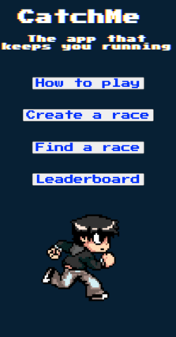
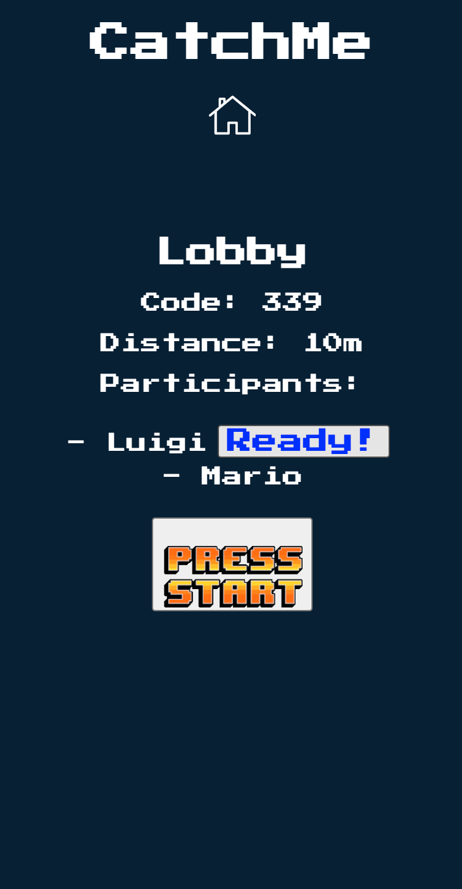
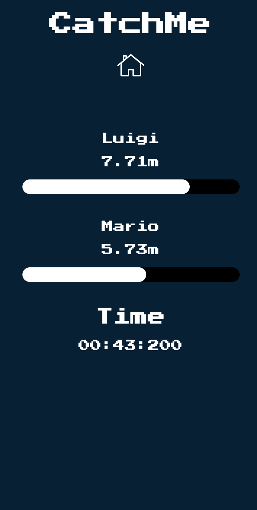
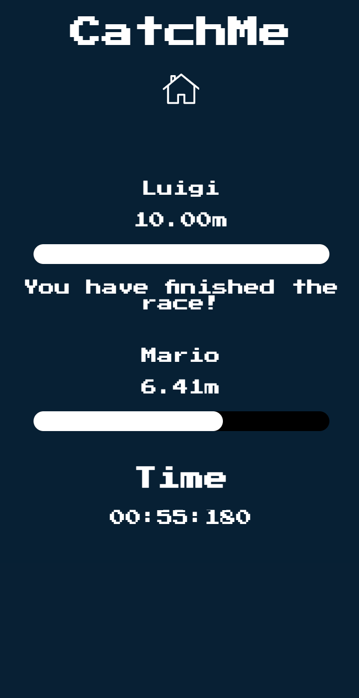
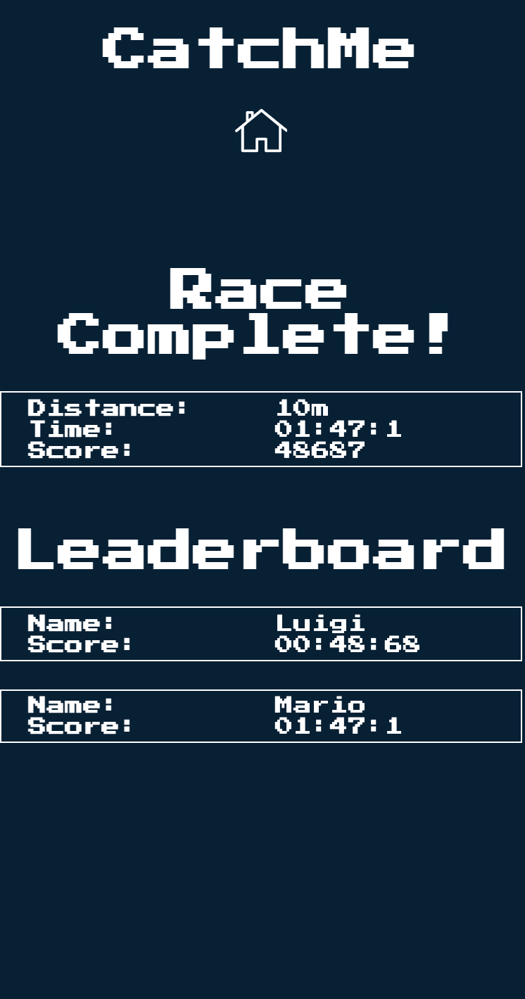
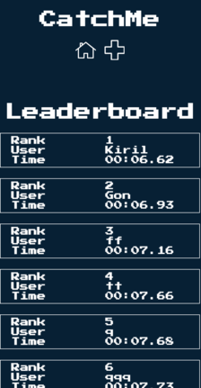

# CatchMe 

CatchMe is a web application that allows you to race with your friends remotely, no login needed!
CatchMe was made as a 2-week final project at Makers Academy. We are [Kiril](https://github.com/kiriarf), [Gonzalo](https://github.com/gonzalober), [David](https://github.com/dm-devtech) and [Mace](https://github.com/mace-akkari).

This repo includes the GraphQL API, which serves as our backend. You can find our frontend, built in ReactJS, [here](https://github.com/gonzalober/catchme-web)

[Demo Video](https://www.youtube.com/watch?v=2YuvLhf_QO8&feature=youtu.be)

[Play CatchMe Here!](https://appcatchme.herokuapp.com)

## How It Works

### Creating the Lobby and Connecting to it

When you open the page, you can select one of the two options: create or find a race.

When create race is selected, you are prompted to choose the distance for your race (in meters), and you become a host of this race. Share the race code with your friends!
When find race is selected, you are prompted to enter the unique race code, and choose your name. You will then be connected to your friend's race as a guest.

### Starting a Race

Once you are in the lobby, you will see all of the participants. Click `Ready!` when you are! You will also be asked to allow location tracking.
Once everybody is ready, the host will be able to see the `Start Race` button and click it.

### Racing!

During the race, the users' real-time position will be tracked and a travel distance will be calculated.

When your distance changes, it will be reflected in the progress bar. You will also see the distance displayed in meters.
If you are lucky to finish first, the app will congratulate you. Now you have to wait for the others to finish...

Once everybody crosses the finish line, you will be taken to a separate page with the race results.

### Results

On the results page, you can see how long it took for the race to finish, as well as everybody's scores. Click the home button on the top of the screen to go back.

### Leaderboard

If you are fast enough to be in the global top 10, you will see your name in the leaderboard. You can access it from the home screen.

## Tech Stack

### Backend

| Technology    | Use                              |
| ------------- | -------------------------------- |
| Jest          | Testing                          |
| ESLint        | Linting, airBNB style guide used |
| Yarn          | package management               |
| Nodemon       | running the server               |
| GraphQL       | API design                       |
| Apollo Server | GraphQL server framework         |
| Sequelize     | Object-relational mapping        |
| PostgreSQL    | Database                         |
| Travis        | CI/CD                            |
| Heroku        | Production Environment           |

### Frontend

| Technology    | Use                           |
| ------------- | ----------------------------- |
| Cypress       | Testing                       |
| ESLint        | Linting                       |
| Yarn          | package management            |
| ReactJS       | Frontend JavaScript Framework |
| Apollo Client | Connecting to the GraphQL API |
| Sass          | Styling                       |
| UIFX          | Adding sounds to pages        |
| Travis        | CI/CD                         |
| Heroku        | Production Environment        |

## Features Coming Soon

- Leaderboard split by distance
- Powerups
